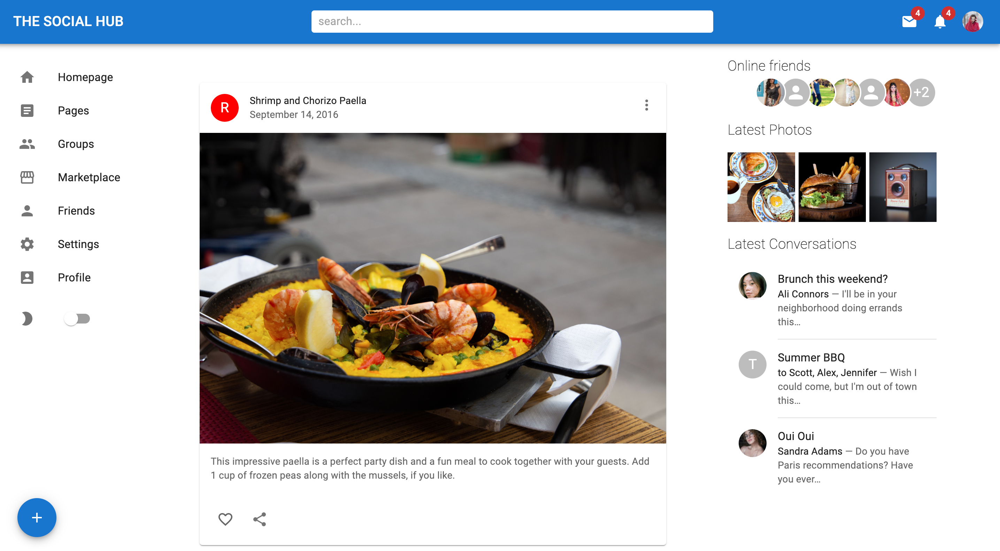
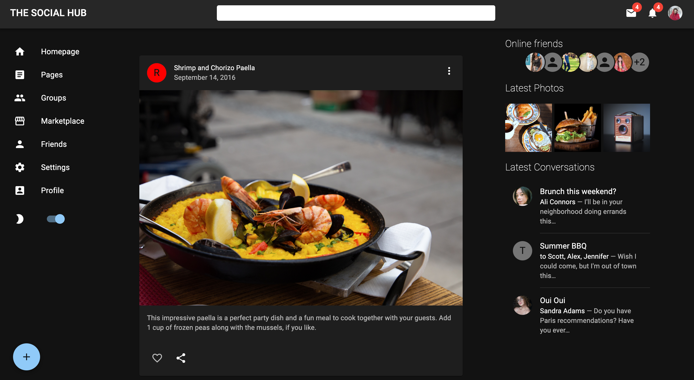

# The Social Hub
Link to project deployed with netlify. Live demo [here](https://the-social-hub.netlify.app/)

## Table of Content
* General Information
* Technologies Used
* Features
* Screenshot
* Installation and Setup Instructions
* Usage
* Project Status
* Room for Improvement
* Acknowledgements
* Contact

## General Information
The Social Hub is a mock social media platform meant to demonstrate how the MUI library can be used to its full extent.

### Purpose of this project

To build a complete platform using the MUI library.

## Technologies Used
* ReactJS
* MUI library
* HTML
* CSS
* JavaScript

## Features
* Search bar.
* Dropdown menu.
* Display of notification badges.
* Light and dark mode.
* Interactive post button.
* Interactive like button.
* Mobile friendly.

## Screenshot
Light Mode

Dark Mode

## Installation and Setup Instructions

Clone down this repository. You will need node and `npm` installed globally on your machine.

### Installation:

`npm install`

To Run Test Suite:

`npm test`

To Start Server:

`npm start`

To Visit App:

`localhost:3000/`

## Usage

**Search**

* Display cursor in the search bar.

**Dropdown Menu**

* Click on the profile picture to view the dropdown menu.

**Dark mode**

* Switch the dark mode button to display a darker theme.

**Add Post**

* Click '+' icon to see the add post modal.

**Like post**

* Click the heart icon to see it change color.

**Mobile Design**

* Minimise page to see a mobile friendly design.

## Project Status
Project is: Completed

## Room for Improvement
* Make the sidebar items interactive.
* Provide more interactive options under each post.

## Acknowledgements
* Many thanks to LamaDev.

## Contact
Created by Abeer Ahmed [LinkedIn profile](https://www.linkedin.com/in/abeerfrontend/) - feel free to contact me.

